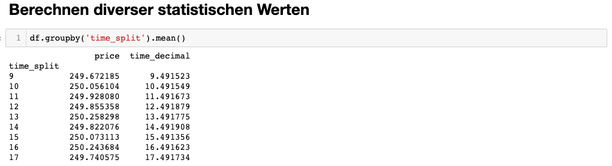
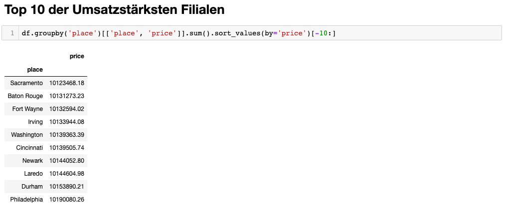

<style>
:root {
    --fhyellow:   rgb(252, 229, 55);
    --black:      rgba(0, 0, 0);
    --blacka:     rgba(0, 0, 0, .1);
    --fhyellowa : rgba(252, 229, 55, .45);
}

table {
    margin-left: 0 !important;
    border-left: 1px solid black;
    border-right:1px solid black; 
}

table td, table th {
    border: 1px solid black !important;
}
h2 {
    margin-top: 2em;
    background-color: var(--fhyellow)
}
h2, h3, h4, h5, h6 {
    color: black;
    border-bottom: 0.2em solid var(--black) !important;
    padding: .5em 0.5em 0 0.5em;
}

blockquote {
    margin: 1em 0;
    border-left:0;
    background: repeating-linear-gradient(
        -45deg,
        var(--fhyellowa),
        var(--fhyellowa) 10px,
        var(--blacka) 10px,
        var(--blacka) 20px
    );
}
</style>

# HadoopMapReduce

## Aufgabe 1: Verkaufsanalyse (Verkaufsanalyse.java)

### Verarbeitung Inputdatei

Die Map Funktion wird für jede Zeile aufgerufen. Die Zeile wird dann anhand von Tabulator-Zeichen aufgetrennt. Die Zeit ist dabei der 2. Wert (im Array der Werte der Zeile). Die Zeit wird danach anhand des `:` (Doppelpunkts) aufgetrennt und anschliessend wird die Stunde in ein `Long` umgewandelt.
Auch der Betrag wird nach selbem Vorgehen extrahiert und in ein `Double` umgewandelt.

### Output Map Funktion

Die Ausgabe der Map-Funktion ist ein Key-Value-Pair für jede Textzeile:

* **Key**\<`LongWritable`\>: Stunde extrahiert aus der Zeit
* **Value**\<`DoubleWritable`\>: Betrag des Einkaufs

### Reduce Funktion

Die Reduce Funktion summiert alle Beträge derselben Stunde auf und berechnet damit den durchschnittlichen Einkaufsbetrag.
Ausgabe der Reduce Funktion ist folgendes Key-Value-Pair:

* **Key**\<`CustomLongWritable`\>: Stunde
* **Value**\<`Double`\>: Durchschnitts-Einkaufsbetrag 

`CustomLongWritable` ist eine Subklasse von `LongWritable` und überschreibt die `toString` Methode. So können wir nicht nur X für die Stunde sondern auch noch ein Label ausgeben.

### CustomPartitioner

Bei der Verwendung von mehreren Reducern ist uns aufgefallen, dass die Ausgabe dann nicht mehr sortiert ist. Wir haben herausgefunden, dass pro Reducer am Schluss eine Datei erstellt wird. Die Werte sind zwar innerhalb der Datei sortiert, aber nicht über mehrere Dateien hinweg. Der verwendete `HashPartitioner` stellt sich als Problem heraus. Deshalb haben wir einen eigenen Partitioner `CustomPartitioner` erstellt. Dieser weist der ersten Partition die tiefsten Keys (Stunden) zu und dem letzten Partitioner die grössten. So ist am Ende die Ausgabe wieder aufsteigend nach Stunden sortiert.
Die Funktion für das Berechnen, an welche Partition ein Key hinzugewiesen wird, hat aber einige kleine Nachteile:

* Die Werte werden nicht gleichmässig wie beim HashPartition auf die Reducer verteilt. Wir haben dass bereits ein wenig behoben, indem wir davon ausgehen, dass zwischen 00:00 und 06:00 sowie 20:00 und 24:00 keine Verkäufe durchgeführt werden. Auch wenn unsere gewählte Funktion nicht optimal ist, kann so die Leistung durch mehrere Reducer erhöht werden und gleichzeitig die Ausgabereihenfolge beibehalten werden. 

Die könnte man natürlich auch noch nachträglich beheben in dem man die Textdateien z.B. mit Commandlinetools sortiert.

### Auszug Ausgabe (alle Dateien konkateniert)

```
Stunde: 9       249.6722 CHF
Stunde: 10      250.0561 CHF
Stunde: 11      249.9281 CHF
Stunde: 12      249.8554 CHF
Stunde: 13      250.2583 CHF
Stunde: 14      249.8221 CHF
Stunde: 15      250.0731 CHF
Stunde: 16      250.2437 CHF
Stunde: 17      249.7406 CHF
```

Aus der obigen Ausgabe kann man keinen Zusammenhang zwischen Stunde und Betrag ermitteln, da sich der minimale und maximale Betrag keine 60 Rp. unterscheiden.  

### Source Code

<a href="./code/Verkaufsanalyse.java">Quellcode Verkaufsanalyse.java</a>

### Quellen

https://intellipaat.com/community/43196/how-do-i-implement-a-custom-partitioner-for-a-hadoop-job

## Aufgabe 2: Die 10 umsatzstärksten Verkaufsläden

### Program I (GroupByUmsatz_1.java)
#### Verarbeitung Inputdatei
Ähnlich wie in der vorherigen Aufgabe werden auch hier die Zeilen zuerst einzeln der `map` Funktion von `MyMapper` übergeben. Dort wird wieder auf das Tabulator Zeichen `\t` gesplittet. 
Es werden Store (an dritter Stelle stehend) und der Preis (an fünfter Stellle stehend) extrahiert.

#### Output Map Funktion
Als Output der `map` Funktion bilden die Preise pro Filiale ein Key-Value-Pair.
Hierbei handelt es sich immer noch um einen einzelnen Einkauf (Zeile in der Inputdatei)

* **Key**\<`Text`\>: Name der Filiale
* **Value**\<`DoubleWritable`\>: Einkaufspreis

#### Reduce Funktion
Die `reduce` Funktion summiert pro einzigartigen Key die einzelnen Preise auf.

* **Key**\<`Text`\>: Name der Filiale
* **Value**\<`DoubleWritable`\>: Summierte Preise über alle Einkäufe hinweg.

Diese werden so über den `Context` geschrieben.  
> TODO kann man das so sagen?

#### Auszug Ausgabe (Formatiert)
Ausgabe aller Umsätze pro Filiale.  
> Sollen hier alle angezeigt werden?
```
Albuquerque         1.005231142000009E7
Anaheim             1.007641635999986E7
Anchorage           9933500.400000038
Arlington           1.0072207970000017E7
Atlanta             9997146.700000007
Aurora              9992970.920000033
Austin              1.005715890000006E7
Bakersfield         1.0031208919999892E7
Baltimore           1.0096521450000046E7
Baton Rouge         1.0131273230000045E7
Birmingham          1.007660652000002E7
Boise               1.003916673999995E7
Boston              1.0039473279999984E7
Buffalo             1.0001941189999972E7
Chandler            9919559.859999971
Charlotte           1.0112531340000011E7
Chesapeake          1.0038504920000015E7
Chicago             1.0062522069999991E7
Chula Vista         9974951.34000008
Cincinnati          1.013950574000003E7
Cleveland           1.0067835839999974E7
Colorado Springs    1.0061105869999904E7
Columbus            1.0035241030000027E7
Corpus Christi      9976522.77000002
Dallas              1.0066548450000033E7
Denver              1.0031534870000027E7
Detroit             9979260.76000007
Durham              1.0153890209999964E7
El Paso             1.001640996999999E7
Fort Wayne          1.0132594020000007E7
Fort Worth          1.012083064999991E7
Fremont             1.0053242360000003E7
Fresno              9976260.259999976
Garland             1.0071043919999976E7
Gilbert             1.0062115190000033E7
Glendale            1.004449396999999E7
Greensboro          1.0033781389999986E7
Henderson           1.0053416049999941E7
Hialeah             1.0047052759999905E7
Honolulu            1.0006273489999935E7
Houston             1.0042106269999942E7
Indianapolis        1.0090272770000042E7
Irvine              1.0084867450000016E7
Irving              1.013394408000006E7
Jacksonville        1.0072003330000032E7
Jersey City         9920141.870000038
Kansas City         9968118.730000015
Laredo              1.0144604979999987E7
Las Vegas           1.0054257979999984E7
Lexington           1.0084510949999994E7
Lincoln             1.0069485399999995E7
Long Beach          1.000638025000005E7
Los Angeles         1.0084576799999993E7
Louisville          1.0008566469999986E7
Lubbock             9958119.150000015
Madison             1.0032035539999986E7
Memphis             1.003856532000002E7
Mesa                1.0053642600000031E7
Miami               9947316.069999991
Milwaukee           1.0064482649999954E7
Minneapolis         1.0011757779999936E7
Nashville           9961450.50999995
New Orleans         9949257.750000019
New York            1.0085293549999982E7
Newark              1.0144052800000045E7
Norfolk             1.008856316999996E7
North Las Vegas     1.0029652509999925E7
Oakland             9947292.519999983
Oklahoma City       1.0118986250000114E7
Omaha               1.002664234000003E7
Orlando             1.0074922520000016E7
Philadelphia        1.0190080259999974E7
Phoenix             1.0079076700000014E7
Pittsburgh          1.0090124820000043E7
Plano               1.004610361000001E7
Portland            1.0007635769999865E7
Raleigh             1.0061442539999923E7
Reno                1.007995515999995E7
Richmond            9992941.589999972
Riverside           1.000669542000001E7
Rochester           1.0067606919999937E7
Sacramento          1.012346817999993E7
Saint Paul          1.0057233570000025E7
San Antonio         1.0014441700000016E7
San Bernardino      9965152.03999996
San Diego           9966038.390000096
San Francisco       9995570.539999973
San Jose            9936721.410000086
Santa Ana           1.005030992999998E7
Scottsdale          1.0037929849999987E7
Seattle             9936267.369999932
Spokane             1.0083362979999999E7
St. Louis           1.0002105139999988E7
St. Petersburg      9986495.540000007
Stockton            1.000641264000008E7
Tampa               1.0106428549999861E7
Toledo              1.0020768880000075E7
Tucson              9998252.469999915
Tulsa               1.0064955899999995E7
Virginia Beach      1.008655349999999E7
Washington          1.0139363390000047E7
Wichita             1.008364321000011E7
Winston–Salem       1.0044011829999985E7
```

### Program II (UmsatzRanking_2.java)

#### Verarbeitung Inputdatei
Als Input wird nun der Output des vorhergehenden Programms verwendet.

In der `MyMapper` Klasse wird eine `TreeMap<Double, String>` verwaltet, welche die Umsätze als Key und Filialnamen als Value speichert. Die `TreeMap` wird in der `setup` Methode initialisiert und ist nach dem Schlüssel absteigend sortiert.   

Auch hier werden die Zeilen wieder einzeln eingelesen und der `map` Funktion von `MyMapper` übergeben.  
Jede Zeile wird dann wieder auf `\t` gesplittet und die Filiale und Umsatz pro Filiale wird in einer `TreeMap` gespeichert. Sobald die `TreeMap` eine Grösse von 10 überschreitet, wird jeweils der letzte Key gelöscht. Da die `TreeMap` niemals grösser als 10 Elemente anwachsen kann, sowie stets absteigend sortiert ist, können wir sicher sein, dass wir die 10 grösten Filialen ermittelt haben sobald alle Zeilen eingelesen wurden.

#### Output Map Funktion
Die 10 Umsatzstärksten Filialen über alle Filialen hinweg.

* **Key**\<`Text`\>: Name der Filiale
* **Value**\<`DoubleWritable`\>: Summierte Preise über alle Einkäufe hinweg.
* **Filtered**: 10 Umsatzstärksten Filialen

Im `cleanup` des `MyMappers` werden alle verbleibenden Keys nach Umsatz sortiert über den `Context` geschreiben.

#### Reduce Funktion
Entfällt hier in diesem Setup.

#### Auszug Ausgabe (Formatiert)
Ausgabe der Top 10 Umsatzstärksten Filialen.

```
Philadelphia    1.0190080259999974E7
Durham          1.0153890209999964E7
Laredo          1.0144604979999987E7
Newark          1.0144052800000045E7
Cincinnati      1.013950574000003E7
Washington      1.0139363390000047E7
Irving          1.013394408000006E7
Fort Wayne      1.0132594020000007E7
Baton Rouge     1.0131273230000045E7
Sacramento      1.012346817999993E7
```

### Source Code Beider Programme

<a href="./code/GroupByUmsatz_1.java">Quellcode Code GroupByUmsatz_1.java</a>  
<a href="./code/UmsatzRanking_2.java">Quellcode Code UmsatzRanking_2.java</a>

### Quellen

https://www.geeksforgeeks.org/how-to-find-top-n-records-using-mapreduce/

https://data-flair.training/forums/topic/how-to-calculate-number-of-mappers-in-hadoop/

## Testing

Um frühzeitig eventuelle Fehler entdecken zu können, haben wir vorgängig die erwarteten Werte
innerhalb eines Jupyter Notebooks mittels `Pandas` ermittelt. Die erhaltenen Resultate stimmen mit dem obigen überein. 

**Resultate der Aufgabe 1**  


**Resultate der Aufgabe 2**  



### Source Code Beider Programme

<a href="./code/purchases analysis.ipynb">Quellcode Code Jupyter Notebook - purchases analysis.ipynb</a>
