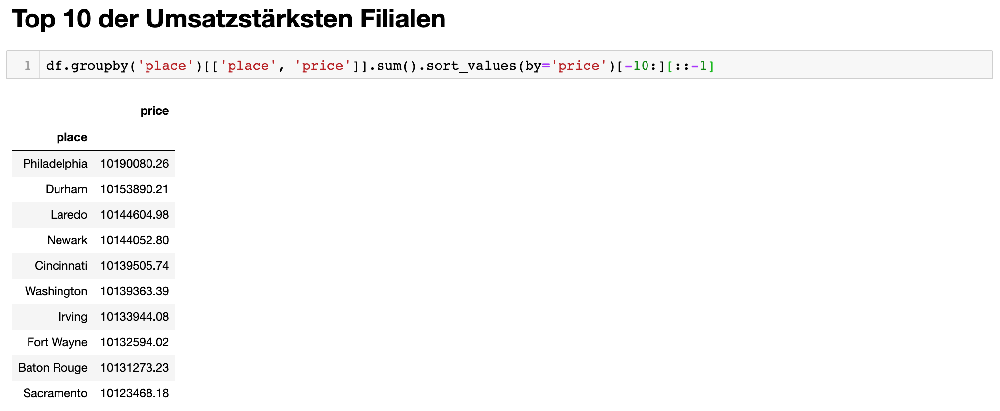

<style>
:root {
    --fhyellow:   rgb(252, 229, 55);
    --black:      rgba(0, 0, 0);
    --blacka:     rgba(0, 0, 0, .1);
    --fhyellowa : rgba(252, 229, 55, .45);
}

table {
    margin-left: 0 !important;
    border-left: 1px solid black;
    border-right:1px solid black; 
}

table td, table th {
    border: 1px solid black !important;
}
h2 {
    margin-top: 2em;
    background-color: var(--fhyellow)
}
h2, h3, h4, h5, h6 {
    color: black;
    border-bottom: 0.2em solid var(--black) !important;
    padding: .5em 0.5em 0 0.5em;
}

blockquote {
    margin: 1em 0;
    border-left:0;
    background: repeating-linear-gradient(
        -45deg,
        var(--fhyellowa),
        var(--fhyellowa) 10px,
        var(--blacka) 10px,
        var(--blacka) 20px
    );
}
</style>

# HadoopMapReduce

## Aufgabe 1: Verkaufsanalyse (Verkaufsanalyse.java)

### Verarbeitung Inputdatei

Die Map Funktion wird für jede Zeile aufgerufen. Die Zeile wird dann anhand von Tabulator-Zeichen aufgetrennt. Die Zeit ist dabei der 2. Wert (im Array der Werte der Zeile). Die Zeit wird danach anhand des `:` (Doppelpunkts) aufgetrennt und anschliessend wird die Stunde in ein `Long` umgewandelt.
Auch der Betrag wird nach selbem Vorgehen extrahiert und in ein `Double` umgewandelt.

### Output Map Funktion

Die Ausgabe der Map-Funktion ist ein Key-Value-Pair für jede Textzeile:

* **Key**\<`LongWritable`\>: Stunde extrahiert aus der Zeit
* **Value**\<`DoubleWritable`\>: Betrag des Einkaufs

### Reduce Funktion

Die Reduce Funktion summiert alle Beträge derselben Stunde auf und berechnet damit den durchschnittlichen Einkaufsbetrag.
Ausgabe der Reduce Funktion ist folgendes Key-Value-Pair:

* **Key**\<`CustomLongWritable`\>: Stunde
* **Value**\<`Double`\>: Durchschnitts-Einkaufsbetrag 

`CustomLongWritable` ist eine Subklasse von `LongWritable` und überschreibt die `toString` Methode. So können wir nicht nur X für die Stunde sondern auch noch ein Label ausgeben.

### CustomPartitioner

Bei der Verwendung von mehreren Reducern ist uns aufgefallen, dass die Ausgabe dann nicht mehr sortiert ist. Wir haben herausgefunden, dass pro Reducer am Schluss eine Datei erstellt wird. Die Werte sind zwar innerhalb der Datei sortiert, aber nicht über mehrere Dateien hinweg. Der verwendete `HashPartitioner` stellt sich als Problem heraus. Deshalb haben wir einen eigenen Partitioner `CustomPartitioner` erstellt. Dieser weist der ersten Partition die tiefsten Keys (Stunden) zu und dem letzten Partitioner die grössten. So ist am Ende die Ausgabe wieder aufsteigend nach Stunden sortiert.
Die Funktion für das Berechnen, an welche Partition ein Key hinzugewiesen wird, hat aber einige kleine Nachteile:

* Die Werte werden nicht gleichmässig wie beim HashPartition auf die Reducer verteilt. Wir haben dass bereits ein wenig behoben, indem wir davon ausgehen, dass zwischen 00:00 und 06:00 sowie 20:00 und 24:00 keine Verkäufe durchgeführt werden. Auch wenn unsere gewählte Funktion nicht optimal ist, kann so die Leistung durch mehrere Reducer erhöht werden und gleichzeitig die Ausgabereihenfolge beibehalten werden. 

Die könnte man natürlich auch noch nachträglich beheben in dem man die Textdateien z.B. mit Commandlinetools sortiert.

### Auszug Ausgabe (alle Dateien konkateniert)

```
Stunde: 9       249.6722 CHF
Stunde: 10      250.0561 CHF
Stunde: 11      249.9281 CHF
Stunde: 12      249.8554 CHF
Stunde: 13      250.2583 CHF
Stunde: 14      249.8221 CHF
Stunde: 15      250.0731 CHF
Stunde: 16      250.2437 CHF
Stunde: 17      249.7406 CHF
```

Aus der obigen Ausgabe kann man keinen Zusammenhang zwischen Stunde und Betrag ermitteln, da sich der minimale und maximale Betrag keine 60 Rp. unterscheiden.  

### Source Code

<a href="./code/Verkaufsanalyse.java">Quellcode Verkaufsanalyse.java</a>

### Quellen

https://intellipaat.com/community/43196/how-do-i-implement-a-custom-partitioner-for-a-hadoop-job

## Aufgabe 2: Die 10 umsatzstärksten Verkaufsläden

### Program I (GroupByUmsatz_1.java)
#### Verarbeitung Inputdatei
Ähnlich wie in der vorherigen Aufgabe werden auch hier die Zeilen zuerst einzeln der `map` Funktion von `MyMapper` übergeben. Dort wird wieder auf das Tabulator Zeichen `\t` gesplittet. 
Es werden Store (an dritter Stelle stehend) und der Preis (an fünfter Stellle stehend) extrahiert.

#### Output Map Funktion
Als Output der `map` Funktion bilden die Preise pro Filiale ein Key-Value-Pair.
Hierbei handelt es sich immer noch um einen einzelnen Einkauf (Zeile in der Inputdatei)

* **Key**\<`Text`\>: Name der Filiale
* **Value**\<`DoubleWritable`\>: Einkaufspreis

#### Reduce Funktion
Die `reduce` Funktion summiert pro Key die einzelnen Preise auf.

* **Key**\<`Text`\>: Name der Filiale
* **Value**\<`DoubleWritable`\>: Summierte Preise über alle Einkäufe hinweg.

#### Auszug Ausgabe (Formatiert)
Ausgabe aller Umsätze pro Filiale.  
```
Albuquerque         1.005231142000009E7
Anaheim             1.007641635999986E7
Anchorage           9933500.400000038
Arlington           1.0072207970000017E7
Atlanta             9997146.700000007
Aurora              9992970.920000033
Austin              1.005715890000006E7
Bakersfield         1.0031208919999892E7
Baltimore           1.0096521450000046E7
Baton Rouge         1.0131273230000045E7
Birmingham          1.007660652000002E7
Boise               1.003916673999995E7
Boston              1.0039473279999984E7
Buffalo             1.0001941189999972E7
Chandler            9919559.859999971
Charlotte           1.0112531340000011E7
....
```

### Program II (UmsatzRanking_2.java)

#### Verarbeitung Inputdatei
Als Input wird nun der Output des vorhergehenden Programms verwendet.

In der `RankingMapper` Klasse wird eine `PriorityQueue<StoreRevenuePair>` verwaltet.
Auch hier werden die Zeilen wieder einzeln eingelesen und der `map` Funktion von `RankingMapper` übergeben.  
Jede Zeile wird dann wieder auf `\t` gesplittet und die Filiale und Umsatz pro Filiale wird in einer `PriorityQueue` gespeichert. Die Intention ist, dass in der `PriorityQueue` für diesen Mapper die 10 umsatzstärken Filialen gespeichert werden.

Sobald die `PriorityQueue` eine Grösse von 10 überschreitet, wird jeweils der letzte Key gelöscht. In der `cleanup` Funktion des Reducers werden dann die 10 umsatzstärksten Filialen mit `Context.write` geschrieben.

#### Output Map Funktion

Gibt in der `cleanUp` Funktion die 10 umsatzstärksten Filialen zurück. 

* **Key**\<`Text`\>: Name der Filiale
* **Value**\<`DoubleWritable`\>: Summierte Preise über alle Einkäufe hinweg (für diese Filiale).


#### Reduce Funktion

Da es bei grossen Eingabedateien mehrere Mappers geben kann, reicht es nicht nur im Mapper zu sortieren und die 10 besten weiterzugeben. Gibt es mehrere Mappers könnte es passieren, dass wir am Schluss mehr als 10 Filialen. Der `RankingReducer` übernimmt also die Aufgabe, aus allen Mappers die 10 besten Fililane auszuwählen. Hierbei wird wieder auf das gleiche Konzept mit der `PriorityQueue` gesetzt wie beim Mapper.

Im `cleanup` des Reducers werden dann die 10 Einträge aus dem `PriorityQueue` extrahiert und sortiert ausgegeben. Dabei wird der Betrag auch noch schön formatiert.

#### Auszug Ausgabe (Formatiert)
Ausgabe der Top 10 Umsatzstärksten Filialen.

```
Philadelphia    1.0190080259999974E7
Durham          1.0153890209999964E7
Laredo          1.0144604979999987E7
Newark          1.0144052800000045E7
Cincinnati      1.013950574000003E7
Washington      1.0139363390000047E7
Irving          1.013394408000006E7
Fort Wayne      1.0132594020000007E7
Baton Rouge     1.0131273230000045E7
Sacramento      1.012346817999993E7
```

### Source Code Beider Programme

<a href="./code/GroupByUmsatz_1.java">Quellcode Code GroupByUmsatz_1.java</a>  
<a href="./code/UmsatzRanking_2.java">Quellcode Code UmsatzRanking_2.java</a>

### Quellen

https://www.geeksforgeeks.org/how-to-find-top-n-records-using-mapreduce/

https://data-flair.training/forums/topic/how-to-calculate-number-of-mappers-in-hadoop/

## Testing

Um frühzeitig eventuelle Fehler entdecken zu können, haben wir vorgängig die erwarteten Werte
innerhalb eines Jupyter Notebooks mittels `Pandas` ermittelt. Die erhaltenen Resultate stimmen mit dem obigen überein. 

**Resultate der Aufgabe 1**  


**Resultate der Aufgabe 2**  



### Source Code Beider Programme

<a href="./code/purchases analysis.ipynb">Quellcode Code Jupyter Notebook - purchases analysis.ipynb</a>
